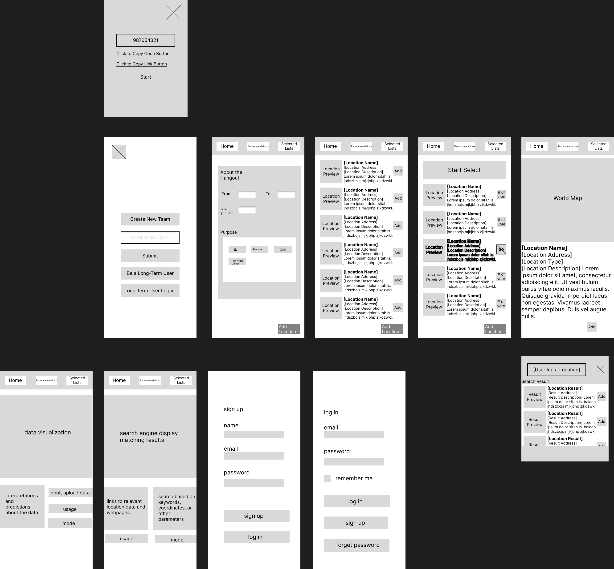

# User Experience Design

## App Map
 

## Prototype
 

[This link](https://www.figma.com/file/JiddLa3f4jKg5Qyvdls1fz/Team-Decider-Prototype?node-id=0%3A1) will lead to our Figma Page.

## Wireframe

 

(From Left to Right)

1. Log In Screen: This screen allows users to create a new group or join a group by entering a group code.
>There is also login and sign up functionality that allows users to track their long-term record and get customized recommendations. However, the idea is not finalized yet.
2. Create a New Team Pop Up: After user selects to create a new team, this pop up will generate a unique code for user share with the rest of team memebers.

 

(From Left to Right)

1. 
2. 

  

(From Left to Right)

1. 
2. 
3. 

 

(From Left to Right)

1. 
2. 
